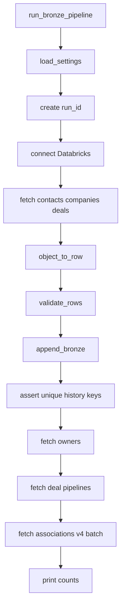

# Architecture

## Goal

Land HubSpot CRM into Unity Catalog bronze: SCD2 for contacts/companies/deals; append history for owners/stages/associations. UC DDL and Jobs are Git/CI-managed (see [cicd_governance.md](cicd_governance.md)).

## Data flow

```text
uc/ddl + Asset Bundle (CI/CD)  →  crm.bronze.* tables exist

HubSpot APIs
    │
    ▼
hubspot_client.py     HTTP, auth, pagination, retries
    │
    ▼
mappers.py            API dict → bronze-shaped dict
    │
    ▼
bronze_loader.py      SCD2 stage/merge + append INSERT (no CREATE)
    │
    ▼
crm.bronze.*          UC Delta tables
```

Orchestrated by `ingestion/pipeline.py` (`run_bronze_pipeline`).



## Module responsibilities

| Module | Owns | Must not |
|---|---|---|
| [`ingestion/config.py`](../ingestion/config.py) | `.env` load, required vars, FQN helpers | HubSpot / SQL |
| [`schemas/object_specs.py`](../schemas/object_specs.py) | Properties to request, table names, **column order** | Network / DB |
| [`ingestion/hubspot_client.py`](../ingestion/hubspot_client.py) | HubSpot HTTP, pagination, 429 retries, owners, pipelines, associations | Delta / MERGE |
| [`ingestion/mappers.py`](../ingestion/mappers.py) | API payload → bronze row dicts | Network / DB |
| [`ingestion/validators.py`](../ingestion/validators.py) | Pre-load quality rules | Network / DB |
| [`ingestion/bronze_loader.py`](../ingestion/bronze_loader.py) | Connect, assert tables exist, append INSERT, SCD2 stage+merge, post-load checks | CREATE TABLE / UC DDL |
| [`uc/ddl/`](../uc/ddl/) | UC CREATE SCHEMA/TABLE source of truth | Runtime ingest path |
| [`resources/`](../resources/) + [`databricks.yml`](../databricks.yml) | Bundle Jobs (serverless ingest) | Catalog Explorer / Jobs UI edits |

| [`ingestion/pipeline.py`](../ingestion/pipeline.py) | Run sequence + logging | Low-level HTTP/SQL details |
| [`utils/hubspot_client.py`](../utils/hubspot_client.py) | Re-export of client for smoke tests | Logic of its own |

## Load patterns

### SCD Type 2 — contacts, companies, deals

Stage → compare to `_is_current` → close changed/missing → insert new versions.

- Version columns: `_valid_from`, `_valid_to`, `_is_current`
- Change attrs: `properties_json`, `archived`, `hubspot_updated_at`, `hubspot_created_at`
- Grain: `(hubspot_id, _valid_from)`; at most one current row per `hubspot_id`
- Current state: `WHERE _is_current = true`

### Append history — owners, stages, associations

`append_bronze` only inserts. Grain: business key(s) + `_ingestion_run_id`.

## Quality rules (enforced)

| Rule | Enforcement |
|---|---|
| Required HubSpot IDs exist | validators + post-load SQL |
| Raw JSON retained | validators + post-load SQL |
| Technical ingestion fields exist | validators + post-load SQL |
| CRM SCD2 current unique | one `_is_current` per `hubspot_id` |
| Append history unique | business key + `_ingestion_run_id` |

Run: `python tests/test_bronze_quality.py` (sampled one ingest; SCD2 `close_missing` off while sampling).

## HubSpot APIs used

| Data | Endpoint family |
|---|---|
| Contacts / companies / deals | `GET /crm/v3/objects/{type}` |
| Owners | `GET /crm/v3/owners` (not objects API) |
| Deal pipeline stages | `GET /crm/v3/pipelines/deals` |
| Associations | `POST /crm/v4/associations/{from}/{to}/batch/read` |

Association pairs loaded:

- contacts → companies → `contact_company_associations`
- deals → companies → `deal_company_associations`
- deals → contacts → `deal_contact_associations`

## Column order contract

Insert tuple order is defined in `schemas/object_specs.py` and must match UC table column order.

Mappers emit the same keys. Loader builds:

```python
tuple(row.get(col) for col in columns)
```

Change a bronze table → update `object_specs` columns **and** the matching mapper in the same PR.
